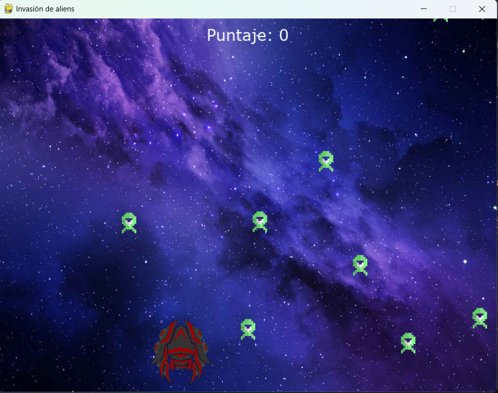
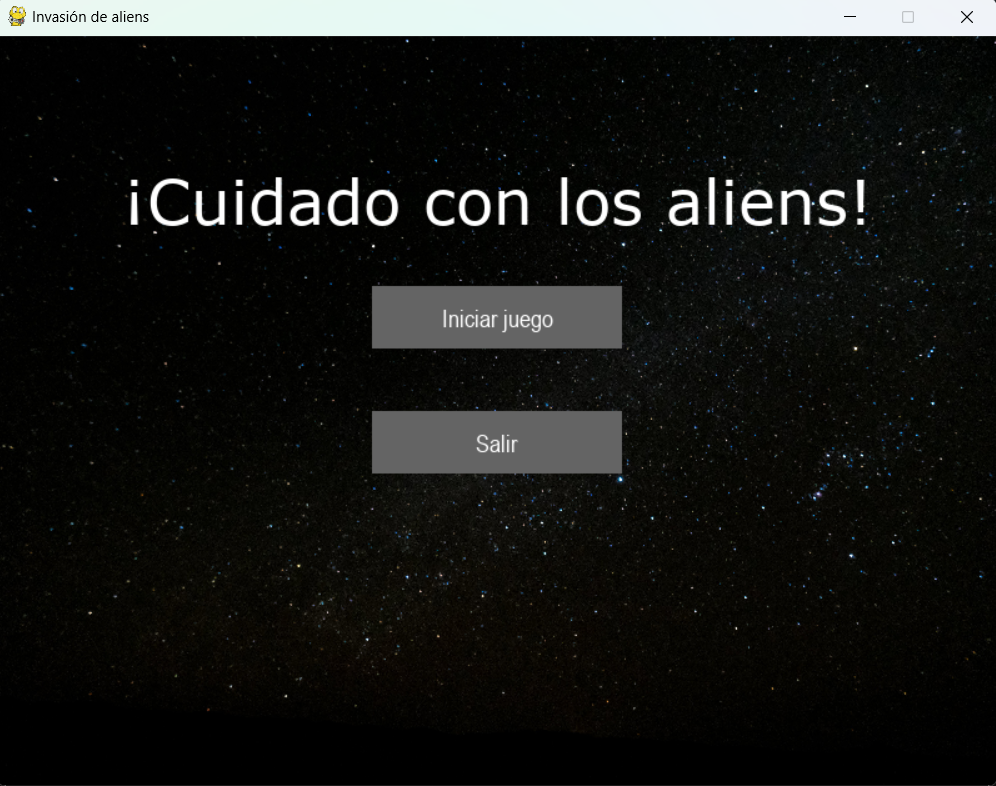

# Invasión de aliens

Este es un proyecto creado con la librería PyGame para Kodlan

## Tabla de Contenidos

1. [Introducción](#introducción)
2. [Características](#características)
3. [Herramientas](#herramientas)

## Introducción

En este juego el objetivo es acumular la mayor cantidad de puntos posibles, cada vez que se elimina un alien se suman 10 puntos. Pierdes si el alien llega a tu nave.

## Características

# Clases del Juego

## Player

- Representa al jugador y/o la nave controlada por el usuario en el juego.
- Maneja la posición y los movimientos del jugador a través del teclado.
- Tiene un método `shoot()` que crea instancias de balas (`Bullet`) cuando el jugador dispara.
- Controla la apariencia y comportamiento del jugador en pantalla.

## Enemy

- Representa los enemigos del juego que el jugador debe esquivar y/o destruir.
- Gestiona la aparición, posición y movimiento de los enemigos en la pantalla.
- Reaparece aleatoriamente cuando alcanza un límite en la pantalla o es destruido.

## Bullet

- Define el comportamiento de las balas disparadas por el jugador (`Player`).
- Gestiona la trayectoria y el movimiento de las balas.
- Se elimina automáticamente cuando sale de la pantalla.

## Button

- Controla la creación y representación de botones en pantalla para el menú.
- Tiene métodos para dibujar botones y detectar clics en ellos.

## Bucle principal
Utiliza un bucle while con una condición (running) para mantener el juego en funcionamiento mientras esa condición sea verdadera. Fue creado con el objetivo de controlar el flujo del juego.
- Alternancia entre menú y juego: 
Usa una variable (in_menu) para controlar si el juego se encuentra en el estado de menú o en el estado de juego propiamente dicho. Esto determina qué elementos se muestran en la pantalla.
- Dibujo de elementos:
Se encarga de mostrar diferentes elementos en la pantalla utilizando las funciones que hice para dibujarlos, como el fondo, los botones del menú, el jugador, los enemigos, entre otros.
- Manejo de eventos:
 Utiliza el bucle for event in pygame.event.get() para capturar y manejar eventos del teclado, mouse y eventos de salida (como perder el juego).
- Actualización de sprites:
Utiliza all_sprites.update() para actualizar la posición y estado de todos los sprites en el juego (jugador, enemigos, láser, etc.) en cada iteración del bucle.
- Colisiones:
Detecta colisiones entre los sprites, como entre los enemigos y el láser (con pygame.sprite.groupcollide()) para eliminar enemigos, sumar puntajes y activar el sonido de la muerte de los aliens. También lo hace entre el jugador y los enemigos para terminar el juego si hay una colisión.

## Herramientas

Para este proyecto utilicé:
- Python 3.12.1
- Pygame 2.5.2
